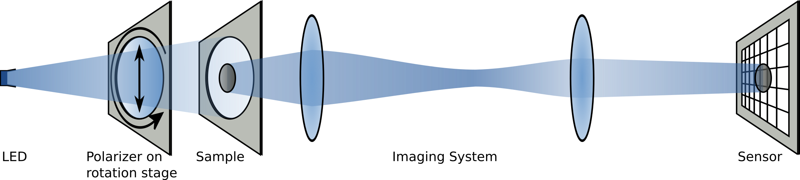

# Dichroism-Imaging
MATLAB GUI to spatially measure the (polarized) dichroism of dyes.

See the following setup. The polarizer can be turned by hand or by a motor. The sensor can be anything that you can read out with MATLAB.

## Aims
* Measure the alignment of dye molecules that are sensitive to the polarization of light.
* Quantify the alignment contrast.
* Flexible definition of measurement method, light color, camera.

## Requirements
* MATLAB (I use version 2018b) with GUIDE. I don't want to move to the new MATLAB App designer because it just leaves a binary blob instead of a plain .m-file.
* light source of the wanted wavelength (close to the absorption maximum of the aligned dye)
* polarizer on rotation stage (can be rotated by hand or automatically)
* CMOS/CCD sensor connected to the computer (I am using a mirrorless camera in combination with a framegrabber).

## License
This project is licensed under the GNU General Public License v3.0 - see the [LICENSE](LICENSE) file for details

## Acknowledgement
You're welcome!
